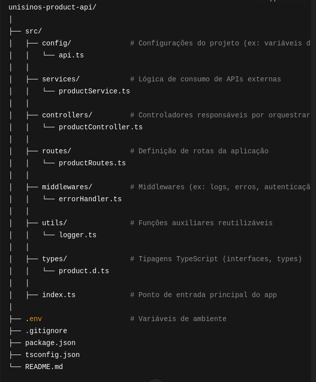
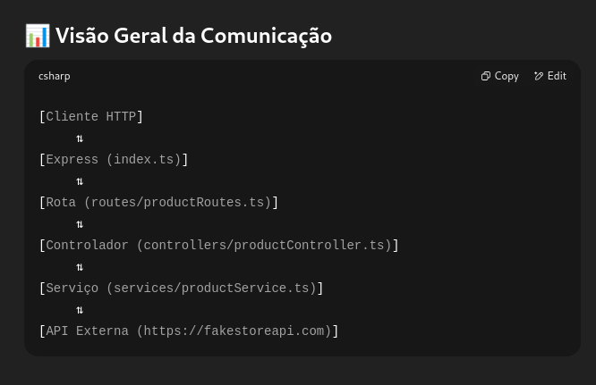

# unisinos-product-api

🏗️ Visão Geral da Arquitetura

A arquitetura foi projetada seguindo os princípios de separação de responsabilidades (SoC - Separation of Concerns) e escalabilidade. A estrutura divide o projeto em camadas bem definidas, facilitando a manutenção, testes e crescimento da aplicação.

📁 src/
Diretório principal do código-fonte. Todos os arquivos TypeScript ficam organizados aqui.

📁 config/
Responsável pelas configurações globais do projeto, como:

URLs base de APIs externas

Timeout de requisições

Carregamento de variáveis de ambiente (dotenv)

🔧 Exemplo: api.ts exporta uma instância do Axios configurada com baseURL da API de produtos.

📁 services/
Contém a lógica de integração com serviços externos, como chamadas HTTP a APIs.
Essa camada não lida com requisições HTTP do Express, apenas com comunicação com o mundo externo.

🔍 Exemplo: productService.ts realiza chamadas GET /products para a API externa.

📁 controllers/
É responsável por controlar o fluxo de entrada/saída das requisições HTTP.
Recebe as requisições Express, chama os serviços e retorna respostas.

🔄 Exemplo: productController.ts usa productService para buscar produtos e envia o resultado como JSON.

📁 routes/
Define as rotas HTTP da aplicação, associando caminhos (/api/products) aos controladores corretos.

📌 Exemplo: productRoutes.ts define a rota GET /api/products e vincula ao fetchProducts().

📁 middlewares/
Contém funções intermediárias (middlewares) para tratamento global de requisições:

Tratamento de erros

Logs

Autenticação (se necessário)

🛡️ Ajuda a deixar o código dos controladores mais limpo.

📁 utils/
Reúne funções utilitárias genéricas que podem ser reutilizadas em qualquer parte do projeto, como:

Funções de formatação

Logs customizados

Conversores de dados

📁 types/
Armazena os tipos e interfaces TypeScript, facilitando a tipagem estática do projeto e reduzindo erros.

📘 Exemplo: product.d.ts define a interface Product, garantindo que todos os dados de produtos tenham a estrutura correta.

📄 index.ts
É o ponto de entrada da aplicação.
Aqui são iniciadas:

Configurações globais (dotenv)

O servidor Express

As rotas

🌐 .env
Arquivo para definir variáveis de ambiente, como a URL da API de produtos:

API_BASE_URL=https://api.exemplo.com/products
PORT=3000

# Visão Geral da comunicação

[Cliente HTTP]
     ⇅
[Express (index.ts)]
     ⇅
[Rota (routes/productRoutes.ts)]
     ⇅
[Controlador (controllers/productController.ts)]
     ⇅
[Serviço (services/productService.ts)]
     ⇅
[API Externa (https://fakestoreapi.com)]

# Instalações Necessárias

npm install axios express dotenv

npm install -D typescript ts-node-dev @types/node @types/express

npm install

# Arquitetura do Projeto
